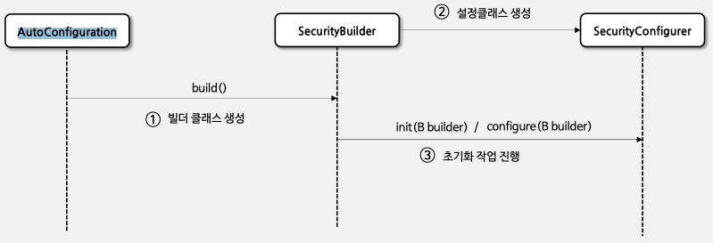
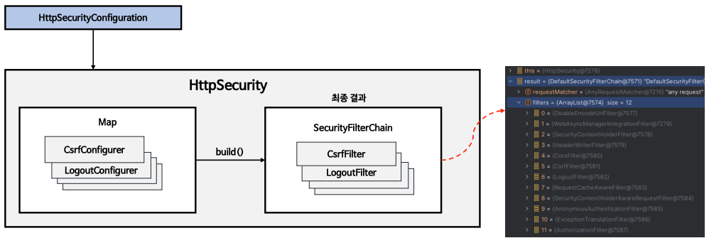
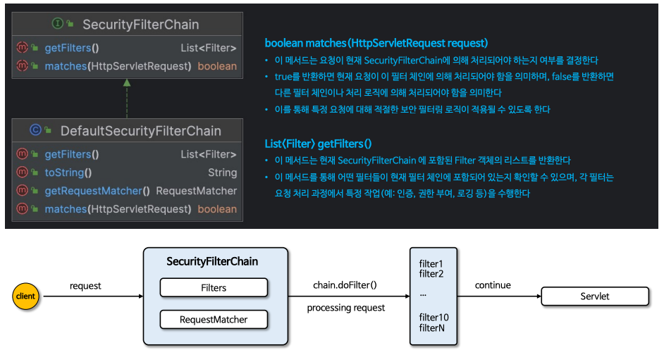
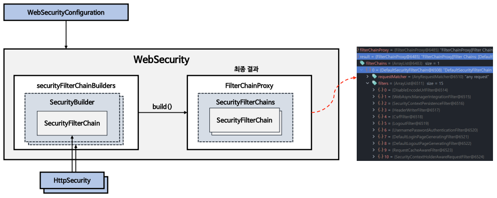

# 01장 초기화 과정 이해

## 자동 설정의 의한 기본 보안 작동
- 서버가 기동되면 스프링 시큐리티의 초기화 작업 및 보안 설정이 이루어진다.
- `별도의 설정이나 코드를 작성하지 않아도 기본적인 웹 보안 기능이 현재 시스템에 연동되어 작동한다.`
  - 기본적으로 모든 요청에 대하여 인증여부를 검증하고 인증이 승인되어야 자원에 접근이 가능하다.
  - 인증 방식은 **폼 로그인 방식**과 **httpBasic 로그인 방식**을 제공한다.
  - 인증을 시도할 수 있는 로그인 페이지가 자동적으로 생성되어 렌더링 된다.
  - 인증 승인이 이루어질 수 있도록 한 개의 계정이 기본적으로 제공된다.
    - SecurityProperties 설정 클래스에서 생성
    - username : user
    - password : 랜덤 문자열

### SpringBootWebSecurityConfiguration
- 자동 설정에 의한 기본 보안 설정 클래스 생성
```
@Bean
@Order(SecurityProperties.BASIC_AUTH_ORDER)
SecurityFilterChain defaultSecurityFilterChain(HttpSecurity http) {
    http.authorizeRequests().anyRequest().authenticated();
    http.formLogin();
    http.httpBasic();
    return http.build;
}
```
- 문제점
  - 계정 추가나 권한 추가 시 문제점
  - 시스템에서 필요로 하는 더 세부적이고 추가적인 보안기능이 필요할 때 문제점


## SecurityBuilder / SecurityConfigurer
### 개념
- **SecurityBuilder** 는 빌더 클래스로서 웹 보안을 구성하는 빈 객체와 설정 클래스들을 생성하는 역할을 하며 대표적으로 **WebSecurity, HttpSecurity** 가 있다.
- **SecurityConfigurer** 는 Http 요청과 관련된 보안처리를 담당하는 필터들을 생성하고 여러 초기화 설정에 관여한다.
- **SecurityBuilder** 는 **SecurityConfigurer** 를 참조하고 있으며 인증 및 인가 초기화 작업은 **SecurityConfigurer** 에 의해 진행된다.




## WebSecurity / HttpSecurity
### HttpSecurity

- **HttpSecurityConfiguration** 에서 **HttpSecurity** 를 생성하고 초기화를 진행한다.
- **HttpSecurity** 는 보안에 필요한 각 설정 클래스와 필터를 생성하고 최종적으로 `SecurityFilterChain` 빈 생성.

### SecurityFilterChain


### WebSecurity

- **WebSeucrityConfiguration** 에서 **WebSecurity** 를 생성하고 초기화를 진행한다.
- **WebSecurity** 는 **HttpSecurity** 에서 생성한 **SecurityFilterChain** 빈을 **SecurityBuilder** 에 저장한다.
- **WebSecurity** 가 build()를 실행하면, **SecurityBuilder** 에서 **SecurityFilterChain** 을 꺼내어 **FilterChainProxy** 생성자에게 전달한다.
- 최종 결과로 **FilterChainProxy** 객체를 만드는 것.