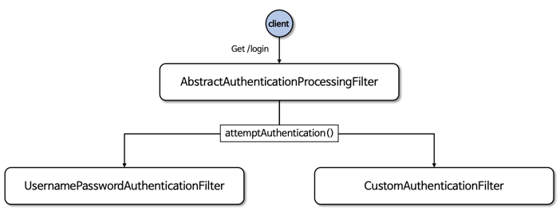
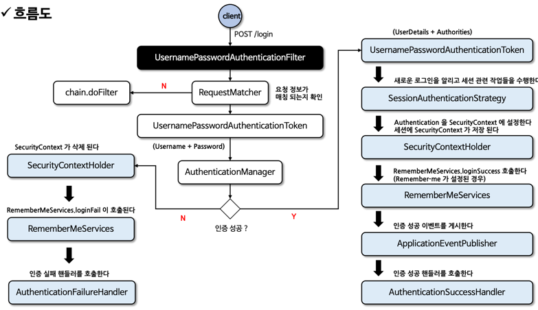

# 02장 인증 프로세스

> 인프런의 정수원님의 스프링 시큐리티 완전 정복 [6.x 개정판]을 보며 실습하고 정리하는 레포지토리 입니다.

## 폼 인증 - formLogin()
### 폼 인증

- HTTP 기반의 폼 로그인 인증 매커니즘을 활성화하는 API 로서 사용자 인증을 위한 사용자 정의 로그인 페이지를 쉽게 구현할 수 있다.
- 기본적으로 스프링 시큐리티가 제공하는 기본 로그인 페이지를 사용하며 사용자 이름과 비밀번호 필드가 포함된 간단한 로그인 양식을 제공한다.
- 사용자는 웹 폼을 통해 자격 증명(사용자 이름과 비밀번호)을 제공하고 **Spring Security** 는 **HttpServlectRequest** 에서 이 값을 읽어 온다.

### formLogin() API
%20API.png)
- **FormLoginConfigurer** 설정 클래스를 통해 여러 API 들을 설정할 수 있다.
- 내부적으로 **UsernamePasswordAuthenticationFilter** 가 생성되어 폼 방식의 인증 처리를 담당하게 된다.

### 폼 인증 필터 - UsernamePasswordAuthenticationFilter

- 스프링 시큐리티는 **AbstractAuthenticationProcessingFilter** 클래스를 사용자의 자격 증명을 인증하는 기본 필터로 사용 한다.
- **UsernamePasswordAuthenticationFilter** 는 **AbstractAuthenticationProcessingFilter** 를 확장한 클래스로서 **HttpServletRequest** 에서
제출된 사용자 이름과 비밀번호로부터 인증을 수행한다.
- 인증 프로세스가 초기화 될 때 로그인 페이지와 로그아웃 페이지 생성을 위한 **DefaultLoginPageGeneratingFilter** 및 **DefaultLogoutGeneratingFilter** 가
초기화 된다.
- 흐름도
  
