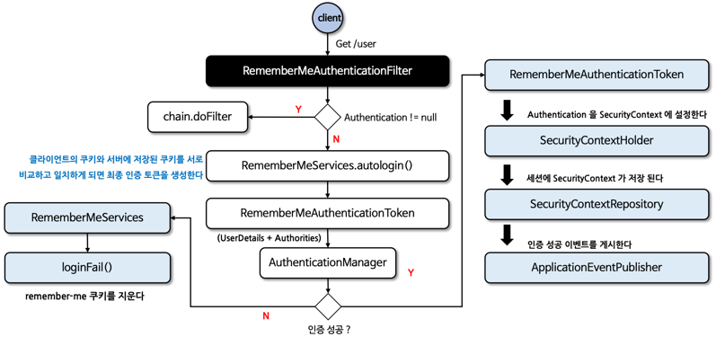
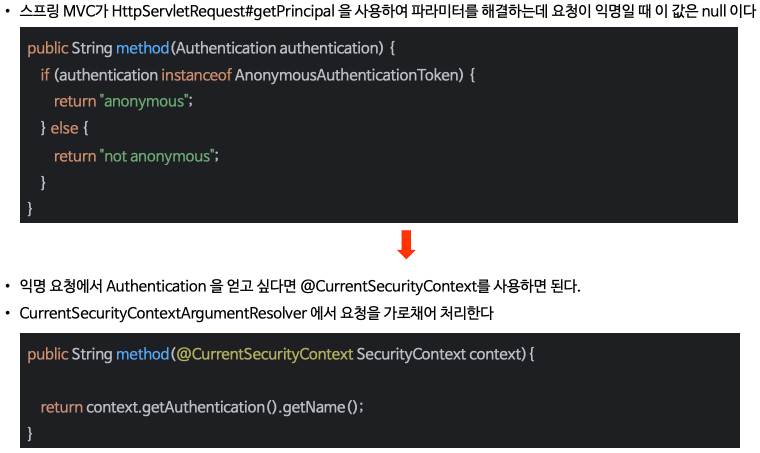
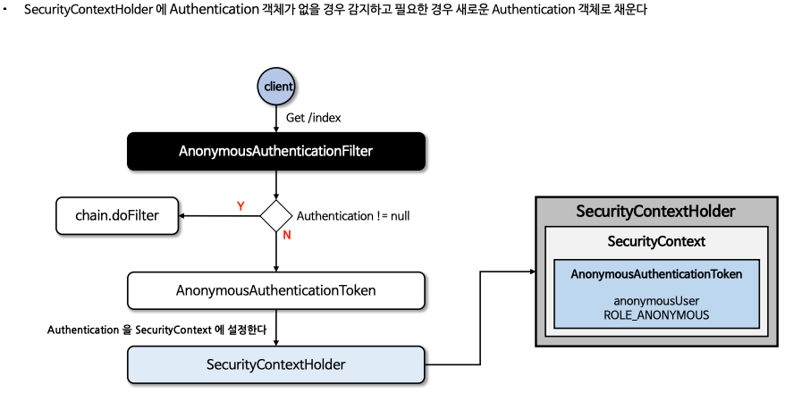

# 02장 인증 프로세스

> 인프런의 정수원님의 스프링 시큐리티 완전 정복 [6.x 개정판]을 보며 실습하고 정리하는 레포지토리 입니다.

## 폼 인증 - formLogin()
### 폼 인증

- HTTP 기반의 폼 로그인 인증 매커니즘을 활성화하는 API 로서 사용자 인증을 위한 사용자 정의 로그인 페이지를 쉽게 구현할 수 있다.
- 기본적으로 스프링 시큐리티가 제공하는 기본 로그인 페이지를 사용하며 사용자 이름과 비밀번호 필드가 포함된 간단한 로그인 양식을 제공한다.
- 사용자는 웹 폼을 통해 자격 증명(사용자 이름과 비밀번호)을 제공하고 **Spring Security** 는 **HttpServlectRequest** 에서 이 값을 읽어 온다.

### formLogin() API
%20API.png)
- **FormLoginConfigurer** 설정 클래스를 통해 여러 API 들을 설정할 수 있다.
- 내부적으로 **UsernamePasswordAuthenticationFilter** 가 생성되어 폼 방식의 인증 처리를 담당하게 된다.

### 폼 인증 필터 - UsernamePasswordAuthenticationFilter

- 스프링 시큐리티는 **AbstractAuthenticationProcessingFilter** 클래스를 사용자의 자격 증명을 인증하는 기본 필터로 사용 한다.
- **UsernamePasswordAuthenticationFilter** 는 **AbstractAuthenticationProcessingFilter** 를 확장한 클래스로서 **HttpServletRequest** 에서
제출된 사용자 이름과 비밀번호로부터 인증을 수행한다.
- 인증 프로세스가 초기화 될 때 로그인 페이지와 로그아웃 페이지 생성을 위한 **DefaultLoginPageGeneratingFilter** 및 **DefaultLogoutGeneratingFilter** 가
초기화 된다.
- 흐름도
  

## 기본 인증 - httpBasic()
### 기본 인증
- HTTP 는 액세스 제어와 인증을 위한 프레임워크를 제공하며, 가장 일반적인 인증 방식은 **Basic** 인증 방식이다.
- RFC 7235 표준이며, 인증 프로토콜은 HTTP 인증 헤더에 기술되어 있다.
- 동작 방식
  - 클라이언트는 인증정보 없이 서버로 접속을 시도한다.
  - 서버가 클라이언트에게 인증요구를 보낼 때 401 Unauthorized 응답과 함께 WWW-Authenticate 헤더를 기술해서 realm(보안영역) 과 Basic 인증방법을 보냄.
  - 클라이언트가 서버로 접속할 때 Base64로 username과 password를 인코딩하고 Authentication 헤더에 담아서 요청함.
  - 성공적으로 완료되면 정상적인 상태 코드를 반환한다.
- **httpBasic() API**
  - **HttpBasicConfigurer** 설정 클래스를 통해 여러 API 들을 설정할 수 있다.
  - 내부적으로 **BasicAuthenticationFilter** 가 생성되어 기본 인증 방식의 인증 처리를 담당하게 된다.
  - 별도의 커스텀을 하지 않고, **BasicAuthenticationFilter** 를 사용해도 되는 거 같다.

### 기본 인증 필터 - BasicAuthenticationFilter
- 이 필터는 기본 인증 서비스를 제공하는데 사용된다.
- **BasicAuthenticationConverter** 를 사용해서 요청 헤더에 기술된 인증정보의 유효성을 체크하며, Base64 로 인코딩된 username과 password를 추출한다.
- 인증 이후 세션을 사용하는 경우와 사용하지 않는 경우에 따라 처리 되는 흐름에 차이가 있다.
- 세션을 사용하는 경우 매 요청마다 인증과정을 거치지 않으나, 세션을 사용하지 않는 경우 매 요청마다 인증과정을 거쳐야 한다.
  - 보통 세션을 사용하지 않는다.
- 흐름도
  

## 기억하기 인증 - rememberMe()
### 기억하기 인증
- 사용자가 웹 사이트나 애플리케이션에 로그인할 때 자동으로 인증 정보를 기억하는 기능이다.
- **UsernamePasswordAuthenticationFilter** 와 함께 사용되며, **AbstractAuthenticationProcessingFilter** 슈퍼클래스에서 훅을 통해 구현된다.
  - 인증 성공시 **RememberMeService.loginSuccess()** 를 통해 **RememberMe** 토큰을 생성하고, 쿠키로 전달한다.
  - 인증 실패시 **RememberMeService.loginFail()** 를 통해 쿠키를 지운다.
  - **LogoutFilter** 와 연계해서 로그아웃 시 쿠키를 지운다.
- **토큰 생성**
  - 기본적으로 암호화된 토큰으로 생성 되어지며 브라우저에 쿠키를 보내고, 향후 세션에서 이 쿠키를 감지하여 자동 로그인이 이루어지는 방식으로 달성된다.
  - `base64(username + ":" + expirationTime + ":" + algorithmName + ":" algorithmHex(username + ":" + expirationTime + ":" password + ":" + key))`
    - username: **UserDetailsService** 로 식별 가능한 사용자 이름
    - password: 검색된 **UserDetails** 에 일치하는 비밀번호
    - expirationTime: **remember-me** 토큰이 만료되는 날짜와 시간, 밀리초로 표현
    - key: **remember-me** 토큰의 수정을 방지하기 위한 개인 키
    - algorithmName: **remember-me** 토큰 서명을 생성하고 검증하는 데 사용되는 알고리즘(기본적으로 SHA-256 알고리즘을 사용)
- **RememberMeServices 구현체**
  - **TokenBasedRememberMeService** - 쿠키 기반 토큰의 보안을 위해 해싱을 사용한다.
  - **PersistentTokenBasedRememberMeServices** - 생성된 토큰을 저장하기 위해 데이터베이스 및 다른 영구 저장 매체를 사용한다.
    - 주로 이것을 사용하는 것 같음. (주로 데이터베이스에 저장하기 때문)
  - 두 구현 모두 사용자의 정보를 검색하기 위한 **UserDetailsService** 가 필요하다.
- **rememberMe() API**
  %20API.png)
  - **RememberMeConfigurer** 설정 클래스를 통해 여러 API 들을 설정할 수 있다.
  - 내부적으로 **RememberMeAuthenticationFilter** 가 생성되어 자동 인증 처리를 담당하게 된다.

### 기억하기 인증 필터 - RememberMeAuthenticationFilter

- **SecurityContextHolder** 에 **Authentication** 이 포함되지 않은 경우 실행되는 필터이다.
- 세션이 만료되었거나 어플리케이션 종료로 인해 인증 상태가 소멸된 경우 토큰 기반 인증을 사용해 유효성을 검사하고, 토큰이 검증되면 자동 로그인 처리를 수행한다.

## 익명 사용자 - anonymous()
- 스프링 시큐리티에서 `익명으로 인증된` 사용자와 인증되지 않은 사용자 간에 실제 개념적 차이는 없으며, 단지 액세스 제어 속성을 구성하는 더 편리한 방법을 제공한다고 
볼 수 있다.
- **SecurityContextHolder** 가 항상 **Authentication** 객체를 포함하고 Null 을 포함하지 않는다는 것을 규칙을 세우게 되면 클래스를 더 견고하게 작성
할 수 있다.
- 인증 사용자와 익명 인증 사용자를 구분해서 어떤 기능을 수행하고자 할 때 유용할 수 있으며, 익명 인증 객체를 세션에 저장하지 않는다.
  - 인증 사용자는 인증 객체를 세션에 저장함.
- 익명 인증 사용자와 권한을 별도로 운용할 수 있다.
  - 즉 인증 된 사용자가 접근할 수 없도록 구성이 가능하다.
- 익명 사용자 API 및 구조
  

### 스프링 MVC에서 익명 인증 사용하기

### AnonymousAuthenticationFilter
