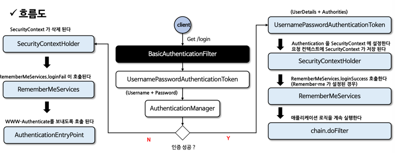

# 02장 인증 프로세스

> 인프런의 정수원님의 스프링 시큐리티 완전 정복 [6.x 개정판]을 보며 실습하고 정리하는 레포지토리 입니다.

## 폼 인증 - formLogin()
### 폼 인증

- HTTP 기반의 폼 로그인 인증 매커니즘을 활성화하는 API 로서 사용자 인증을 위한 사용자 정의 로그인 페이지를 쉽게 구현할 수 있다.
- 기본적으로 스프링 시큐리티가 제공하는 기본 로그인 페이지를 사용하며 사용자 이름과 비밀번호 필드가 포함된 간단한 로그인 양식을 제공한다.
- 사용자는 웹 폼을 통해 자격 증명(사용자 이름과 비밀번호)을 제공하고 **Spring Security** 는 **HttpServlectRequest** 에서 이 값을 읽어 온다.

### formLogin() API
%20API.png)
- **FormLoginConfigurer** 설정 클래스를 통해 여러 API 들을 설정할 수 있다.
- 내부적으로 **UsernamePasswordAuthenticationFilter** 가 생성되어 폼 방식의 인증 처리를 담당하게 된다.

### 폼 인증 필터 - UsernamePasswordAuthenticationFilter

- 스프링 시큐리티는 **AbstractAuthenticationProcessingFilter** 클래스를 사용자의 자격 증명을 인증하는 기본 필터로 사용 한다.
- **UsernamePasswordAuthenticationFilter** 는 **AbstractAuthenticationProcessingFilter** 를 확장한 클래스로서 **HttpServletRequest** 에서
제출된 사용자 이름과 비밀번호로부터 인증을 수행한다.
- 인증 프로세스가 초기화 될 때 로그인 페이지와 로그아웃 페이지 생성을 위한 **DefaultLoginPageGeneratingFilter** 및 **DefaultLogoutGeneratingFilter** 가
초기화 된다.
- 흐름도
  

### 기본 인증 - httpBasic()
- HTTP 는 액세스 제어와 인증을 위한 프레임워크를 제공하며, 가장 일반적인 인증 방식은 **Basic** 인증 방식이다.
- RFC 7235 표준이며, 인증 프로토콜은 HTTP 인증 헤더에 기술되어 있다.
- 동작 방식
  - 클라이언트는 인증정보 없이 서버로 접속을 시도한다.
  - 서버가 클라이언트에게 인증요구를 보낼 때 401 Unauthorized 응답과 함께 WWW-Authenticate 헤더를 기술해서 realm(보안영역) 과 Basic 인증방법을 보냄.
  - 클라이언트가 서버로 접속할 때 Base64로 username과 password를 인코딩하고 Authentication 헤더에 담아서 요청함.
  - 성공적으로 완료되면 정상적인 상태 코드를 반환한다.
- **httpBasic() API**
  - **HttpBasicConfigurer** 설정 클래스를 통해 여러 API 들을 설정할 수 있다.
  - 내부적으로 **BasicAuthenticationFilter** 가 생성되어 기본 인증 방식의 인증 처리를 담당하게 된다.
  - 별도의 커스텀을 하지 않고, **BasicAuthenticationFilter** 를 사용해도 되는 거 같다.

### 기본 인증 필터 - BasicAuthenticationFilter
- 이 필터는 기본 인증 서비스를 제공하는데 사용된다.
- **BasicAuthenticationConverter** 를 사용해서 요청 헤더에 기술된 인증정보의 유효성을 체크하며, Base64 로 인코딩된 username과 password를 추출한다.
- 인증 이후 세션을 사용하는 경우와 사용하지 않는 경우에 따라 처리 되는 흐름에 차이가 있다.
- 세션을 사용하는 경우 매 요청마다 인증과정을 거치지 않으나, 세션을 사용하지 않는 경우 매 요청마다 인증과정을 거쳐야 한다.
  - 보통 세션을 사용하지 않는다.
- 흐름도
  