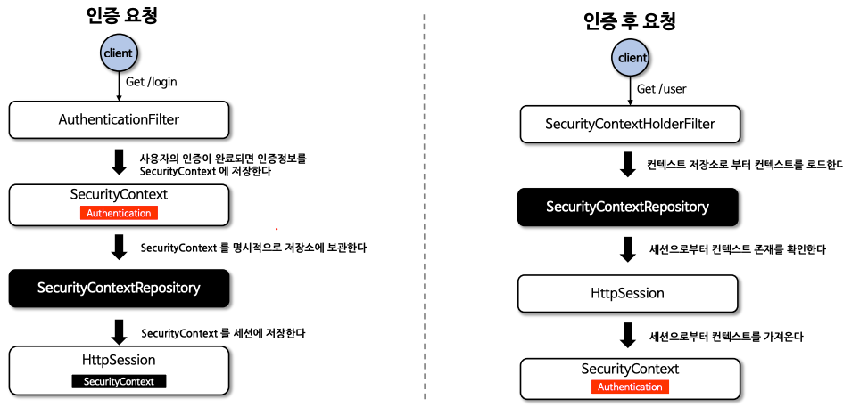

# 인증 상태 영속성

> 인프런의 정수원님의 스프링 시큐리티 완전 정복 [6.x 개정판]을 보며 실습하고 정리하는 레포지토리 입니다.

## SecurityContextRepository / SecurityContextHolderFilter
### SecurityContextRepository

- 스프링 시큐리티에서 사용자가 인증을 한 이후 요청에 대해 계속 사용자의 인증을 유지하기 위해 사용되는 클래스이다.
- 인증 상태의 영속 메커니즘은 사용자가 인증을 하게 되면, 해당 사용자의 인증 정보와 권한이 **SecurityContext**에 저장되고, **HttpSession** 을 통해
요청 간 영속이 이루어 지는 방식이다.

### 구조

- **HttpSessionSecurityContextRepository**
  - 요청 간에 **HttpSession** 에 보안 컨텍스트를 저장한다.
  - 후속 요청 시 컨텍스트 영속성을 유지한다.
- **RequestAttributeSecurityContextRepository**
  - **ServletRequest**에 보안 컨텍스트를 저장한다.
  - 후속 요청 시 컨텍스트 영속성을 유지할 수 없다.
- **NullSecurityContextRepository**
  - 세션을 사용하지 않는 인증 (JWT, OAuth2) 일 경우 사용하며, 컨텍스트 관련 아무런 처리를 하지 않는다.
- **DelegatingSecuriyContextRepository**
  - **RequestAttributeSecurityContextRepository** 와 **HttpSessionSecurityContextRepository** 를 동시에 사용할 수 있도록 위임된 클래스로서 초기화 시 기본으로 설정된다.

### SecurityContextHolderFilter
- **SecurityContextRepository** 를 사용하여 **SecurityContext** 를 얻고, 이를 통해 **SecurityContextHolder** 에 설정하는 필터 클래스이다.
- 이 필터 클래스는 `SecurityContextRepository.saveContext()` 를 강제로 실행시키지 않고, 사용자가 명시적으로 호출되어야 **SecurityContext** 를 저장할 수 있는데 이는 **SecurityContextPersistenceFilter(곧 사라짐)** 와 다른점이다.
- 인증이 지속되어야 하는지를 각 인증 메커니즘이 독립적으로 선택할 수 있게 하여, 더 나은 유연성을 제공하고 **HttpSession** 에 필요할 때만 저장함으로서 성능을 향상시킨다.

### SecurityContext 생성, 저장, 삭제
- **익명 사용자**
  - **SecurityContextRepository** 를 사용하여 새로운 **SecurityContext** 객체를 생성하여 **SecurityContextHodler** 에 저장 후 다음 필터로 전달
  - **AnontmousAuthenticationFilter** 에서 **AnonymousAuthenticationToken** 객체를 **SecurityContext** 에 저장
- **인증 요청**
  - **SecurityContextRepository** 를 사용하여 새로운 **SecurityContext** 객체를 생성하여 **SecuritycontextHolder** 에 저장 후 다음 필터로 전달
  - **UsernamePasswordAuthenticationFilter** 에서 인증 성공 후 **SecurityContext** 에 **UsernamePasswordAuthentication** 객체를 **SecurityContext** 에 저장
  - **SecurityContextRepository** 를 사용하여 **HttpSession** 에 **SecurityContext** 를 저장
- **인증 후 요청**
  - **SecurityContextRepository** 를 사용하여 **HttpSession** 에서 **SecurityContext** 를 꺼내어 **SecurityContextHolder** 에 저장 후 다음 필터로 전달
  - **SecurityContext** 안에 **Authentication** 객체가 존재하면 계속 인증을 유지한다.
- **클라이언트 응답 시 공통**
  - `SecurityContextHolder.clearContext()` 로 컨텍스트를 삭제한다. **(스레드 풀의 스레드일 경우 반드시 필요)**

### SecurityContextHolderFilter 흐름도


### SecurityContextHolderFilter & SecurityContextPersistanceFilter 차이


### securityContext() API
%20API.png)
- 현재 **SecurityContextPersistanceFilter** 은 **Deprecated** 되었기 때문에, 레거시 시스템 외에는 **SecurityContextHolderFilter** 를
사용하면 된다.

### CustomAuthenticationFilter & SecurityContextRepository
- 커스텀한 인증 필터를 구현할 경우 인증이 완료된 후 **SecurityContext** 를 **SecurityContextHolder** 에 설정한 후, **securityContextRepository** 에
저장하기 위한 코드를 명시적으로 작성해 주어야 한다.
```Java
    securityContextHolderStrategy.setContext(context);
    securityContextRepository.saveContext(context, request, response);
```
- **securityContextRepository** 는 **HttpSessionSecurityContextRepository** 혹은 **DelegatingSecurityContextRepository** 를
사용하면 된다.