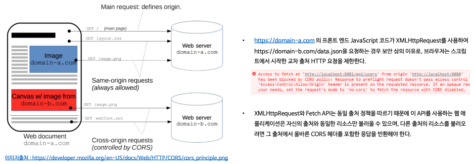
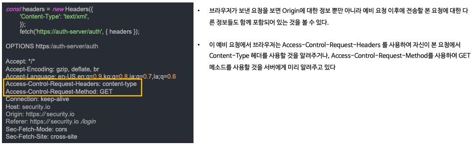
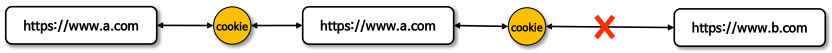
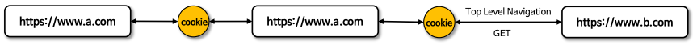
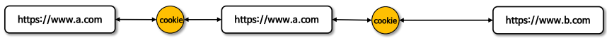

# 악용 보호

> 인프런의 정수원님의 스프링 시큐리티 완전 정복 [6.x 개정판]을 보며 실습하고 정리하는 레포지토리 입니다.

## CORS (Cross Origin Resource Sharing)
### CORS(Cross Origin Resource Sharing, 교차 출처 리소스 공유)

- 웹에서는 보안을 위해 기본적으로 한 웹페이지(출처 A)에서 다른 웹 페이지(출처 B)의 데이터를 직접 불러오는 것을 제한하는데 이를 `동일 출처 정책(Same-Origin Policy`
이라고 한다.
- 만약 다른 출처의 리소스를 안전하게 사용하고자 할 경우 **CORS** 가 등장하여 **CORS**는 특별한 **HTTP 헤더**를 통해 한 웹 페이지가 다른 출처의 리소스에
접근할 수 있도록 `허가`를 구하는 방법이라고 할 수 있다.
  - 즉, 웹 어플리케이션이 다른 출처의 데이터를 사용하고자 할 때, 브라우저가 그 요청을 대신해서 해당 데이터를 사용해도 되는지 다른 출처에게 물어보는 것이라 할 수 있다.
- 출처를 비교하는 로직은 서버에 구현된 스펙이 아닌 브라우저에 구현된 스펙 기준으로 처리되며, 브라우저는 클라이언트의 요청 헤더와 서버의 응답헤더를 비교해서 최종 응답을 결정한다.
- 두 개의 출처를 비교하는 방법은 **URL**의 구성요소 중 **Protocol, Host, Port** 이 세 가지가 동일한지 확인하면 되고, 나머지는 틀려도 상관없다.

### CORS 종류
- **Simple Request**
  
  - 예비 요청(Preflight) 과정 없이 자동으로 **CORS**가 작동하여 서버에 본 요청을 한 후, 서버가 응답의 헤더에 **Access-Control-Allow-Origin** 과
  같은 값을 전송하면 브라우저가 서로 비교 후 **CORS** 정책 위반여부를 검사하는 방식이다.
  - 제약 사항
    - **GET, POST, HEAD** 중의 한 가지 **Method**를 사용해야 한다.
    - 헤더는 Accept, Accept-Language, Content-Language, Content-Type, DPR, Downlink, Save-Data, Viewport-Width Width 만 가능하고 Custom Header 는 허용되지
      않는다.
    - Content-type 은 application/x-www-form-urlencoded, multipart/form-data, text/plain 만 가능하다.
- **Preflight Request (예비 요청)**
  
  - 브라우저는 요청을 한 번에 보내지 않고, 예비 요청과 본 요청으로 나누어 서버에 전달하는데 브라우저가 예비요청을 보내는 것을 **Preflight** 라고 하며, 이 예비 요청의
  메소드에는 **OPTIONS**가 사용된다.
  - 예비요청의 역할은 본 요청을 보내기 전에 브라우저 스스로 안전한 요청인지 확인하는 것으로 요청 사양이 **Simple Request**에 해당하지 않을 경우 브라우저가
  **Preflight Request**를 실행한다.
  - 예시
    - 클라이언트
      
    - 서버의 응답
      

### 동일 출처 기준

### CORS 해결 - 서버에서 Access-Control-Allow-* 세팅
- Access-Control-Allow-Origin - 헤더에 작성된 출처만 브라우저가 리소스를 접근할 수 있도록 허용한다. 
  - *, https://security.io
- Access-Control-Allow-Methods - preflight request 에 대한 응답으로 실제 요청 중에 사용할 수 있는 메서드를 나타낸다. 
  - 기본값은 GET,POST,HEAD,OPTIONS, *
- Access-Control-Allow-Headers - preflight request 에 대한 응답으로 실제 요청 중에 사용할 수 있는 헤더 필드 이름을 나타낸다. 
  - 기본값은 Origin,Accept,X-Requested-With,Content-Type, Access-Control-Request-Method,Access-Control-Request-Headers, Custom Header, *  
- Access-Control-Allow-Credentials - 실제 요청에 쿠기나 인증 등의 사용자 자격 증명이 포함될 수 있음을 나타낸다. Client 의 credentials:include 옵션일 경우 true 는 필수
- Access-Control-Max-Age - preflight 요청 결과를 캐시 할 수 있는 시간을 나타내는 것으로 해당 시간동안은 preflight 요청을 다시 하지 않게 된다.

### cors() & CorsFilter
%20&%20CorsFilter.png)
- **CORS**의 사전 요청(pre-flight request)에는 쿠키(JSESSIONID)가 포함되어 있지 않기 때문에, **Spring Security** 이전에 처리되어야 한다.
- 사전 요청에 쿠키가 없고 **Spring Security**가 가장 먼저 처리되면 요청은 사용자가 인증되지 않았다고 판단하고 거부할 수 있다.
- **CORS**가 먼저 처리되도록 하기 위해 **CorsFilter**를 사용할 수 있으며 **CorsFilter**에 **CorsConfigurationSource**를 제공함으로써
**Spring Security**와 통합 할 수 있다.

## CSRF (Cross Site Request Forgery)
### CSRF(Cross Site Request Forgery, 사이트 간 요청 위조)
- 웹 애플리케이션의 보안 취약점으로 공격자가 사용자로 하여금 이미 인증된 다른 사이트에 대해 원치 않는 작업을 수행하게 만드는 기법을 말한다.
- 이 공격은 사용자의 브라우저가 자동으로 보낼 수 있는 인증 정보, 예를 들어 쿠키나 기본 인증 세션을 이용하여 사용자가 의도하지 않은 요청을 서버로 전송하게 만든다.
- 이는 사용자가 로그인한 상태에서 악의적인 웹사이트를 방문하거나 이메일 등을 통해 악의적인 링크를 클릭할 때 발생할 수 있다.

### CSRF 진행 순서

### CSRF 기능 활성화

- 토큰은 서버에 의해 생성되어 클라이언트의 세션에 저장되고 폼을 통해 서버로 전송되는 모든 변경 요청에 포함되어야 하며 서버는 이 토큰을 검증하여 요청의 유효성을 확인한다.
- 기본 설정은 `GET`, `HEAD`, `TRACE`, `OPTIONS` 와 같은 안전한 메서드는 무시하고, `POST`, `PUT`, `DELETE` 와 같은 변경 요청 메서드에 대해서만 **CSRF 토큰 검사**를 수행한다.
- 중요한 점은 실제 **CSRF 토큰**이 브라우저에 의해 자동으로 포함되지 않는 요청 부분에 위치해야 한다는 것으로 **HTTP 매개변수**나 헤더에 실제 **CSRF 토큰**을 요구하는 것이 **CSRF 공격**을 방지하는데 효과적이라 할 수 있다.
- 반면에 쿠키에 토큰을 요구하는 것은 브라우저가 쿠키를 자동으로 요청에 포함시키기 때문에 효과적이지 않다고 볼 수 있다.

### CSRF 기능 비활성화
- **CSRF 의 기능 전체 비활성화**
   
  
- **CSRF 보호가 필요하지 않은 특정 엔드포인트만 비활성화**
  
  
  

## CSRF 토큰 유지 및 검증
### CSRF 토큰 유지 - CsrfTokenRepository
- **CsrfToken**은 **CsrfTokenRepository**를 사용하여 영속화하며, **HttpSessionCsrfTokenRepository** 와 **CookieCsrfTokenRepository** 를 지원한다.
- 두 군데 중 원하는 위치에 토큰을 저장하도록 설정을 통해 지정할 수 있다.
- **세션에 토큰 저장 - HttpSessionCsrfTokenRepository**
  
  
  - 기본적으로 토큰을 세션에 저장하기 위해 **HttpSessionCsrfTokenRepository** 를 사용한다.
  - **HttpSessionCsrfTokenRepository** 는 기본적으로 **HTTP 요청 헤더**인 **X-CSRF-TOKEN 또는  매개 변수인 _csrf** 에서 토큰을 읽는다.
    

- **쿠키에 토큰 저장 - CookieCsrfTokenRepository**
    
  
  - **JavaScript 기반 애플리케이션**을 지원하기 위해 **CsrfToken** 을 쿠키에 유지할 수 있으며 구현체로 **CookieCsrfTokenRepository**를 사용할 수 있다.
  - **CookieCsrfTokenRepository** 는 기본적으로 XSRF-TOKEN 명을 가진 쿠키에 작성하고 **HTTP 요청 헤더인 X-XSRF-TOKEN 또는 요청 매개변수인 _csrf**에서 읽는다.
    
  - **JavaScript** 에서 쿠키를 읽을 수 있도록 **HttpOnly**를 명시적으로 **false** 로 설정할 수 있다.
  - **JavaScript**로 직접 쿠키를 읽을 필요가 없는 경우 보안을 개선하기 위해 **HttpOnly** 를 생략하는 것이 좋다.

### CSRF 토큰 처리 - CsrfTokenRequestHandler
- **CsrfToken** 은 **CsrfTokenRequestHandler** 를 사용하여 토큰을 생성 및 응답하고 **HTTP 헤더 또는 요청 매개변수** 로부터 토큰의 유효성을 검증하도록 한다.
- **XorCsrfTokenRequestAttributeHandler** 와 **CsrfTokenRequestAttributeHandler** 를 제공하며 사용자 정의 핸들러를 구현할 수 있다.
  
  
  - `_csrf` 및 `CsrfToken.class.getName()` 명으로 **HttpServletRequest** 속성에 **CsrfToken** 을 저장하며 **HttpServletRequest** 으로부터 **CsrfToken** 을 꺼내어 참조할 수 있다.
  - 토큰 값을 요청 헤더 (기본적으로 X-CSRF-TOKEN 또는 X-XSRF-TOKEN 중 하나) 또는 요청 매개변수 (_csrf) 중 하나로부터 토큰의 유효성 비교 및 검증을 해결한다.
  - 클라이언트의 매 요청마다 **CSRF 토큰 값(UUID)** 에 난수를 인코딩하여 변경한 **CsrfToken** 이 반환 되도록 보장한다. 세션에 저장된 원본 토큰 값은 그대로 유지한다.
  - 헤더 값 또는 요청 매개변수로 전달된 인코딩 된 토큰은 원본 토큰을 얻기 위해 디코딩되며, 그런 다음 세션 혹은 쿠키에 저장된 영구적인 **CsrfToken** 과 비교된다.

### CSRF 토큰 지연 로딩

- 기본적으로 **Spring Security** 는 **CsrfToken** 을 필요할 때까지 로딩을 지연시키는 전략을 사용한다.
  - 그러므로 **CsrfToken** 은 **HttpSession** 에 저장되어 있기 때문에 매 요청마다 세션으로부터 **CsrfToken** 을 로드할 필요가 없어져 성능을 향상 시킬 수 있다.
- **CsrfToken** 은 **POST** 와 같은 안전하지 않은 **HTTP 메서드**를 사용하여 요청이 발생할 때와 **CSRF 토큰**을 응답에렌더링하는 모든 요청에 필요하기 때문에 그 외 요청에는 지연로딩하는 것이 권장된다.
  

## CSRF 통합
### 개요
- **CSRF 공격**을 방지하기 위한 토큰 패턴을 사용하려면 실제 **CSRF 토큰**을 **HTTP 요청**에 포함해야 한다.
- 그래서 브라우저에 의해 **HTTP 요청**에 자동으로 포함되지 않는 요청 부분(폼 매개변수, HTTP 헤더 또는 기타 부분) 중 하나에 포함되어야 한다.

### HTML Forms

- HTML 폼을 서버에 제출하려면 **CSRF 토큰**을 hidden 값으로 Form 에 포함해야 한다.
- 폼에 실제 **CSRF 토큰**을 자동으로 포함하는 뷰는 다음과 같다.
  - Thymeleaf
  - Spring 의 폼 태그 라이브러리 - <%@ taglib prefix="form" uri="http://www.springframework.org/tags/form" %>

### JavaScript Applications
- **Single Page Application**

  
  - `CookieCsrfTokenRepository.withHttpOnlyFalse` 를 사용해서 클라이언트가 서버가 발행한 쿠키로 부터 **CSRF 토큰**을 읽을 수 있도록 한다.
  - 사용자 정의 **CsrfTokenRequestHandler** 을 만들어 클라이언트가 요청 헤더나 요청 파라미터로 **CSRF 토큰**을 제출할 경우 이를 검증하도록 구현한다.
  - 클라이언트의 요청에 대해 CSRF 토큰을 쿠키에 렌더링해서 응답할 수 있도록 필터를 구현한다.

- **Multi Page Application**
  
  
  - JavaScript 가 각 페이지에서 로드되는 멀티 페이지 애플리케이션의 경우 **CSRF 토큰**을 쿠키에 노출시키는 대신에 HTML 메타 태그 내에 **CSRF 토큰**을 포함시킬 수 있다.

## SameSite
### 개요
- **SameSite** 는 최신 방식의 CSRF 공격 방어 방법 중 하나로서 서버가 쿠키를 설정할 때 **SameSite** 속성을 지정하여 크로스 사이트 간 쿠키 전송에 대한 제어를 핸들링 할 수 있다.
- **Spring Security** 는 세션 쿠키의 생성을 직접 제어하지 않기 때문에 **SameSite** 속성에 대한 지원을 제공하지 않지만 **Spring Session**은 **SameSite** 속성을 지원한다.

### SameSite 속성
- **Strict**
  
  - 동일 사이트에서 오는 모든 요청에 쿠키가 포함되고, 크로스 사이트간 HTTP 요청에 쿠키가 포함되지 않는다.
- **Lax(기본 설정)**
  
  - 동일 사이트에서 오거나 Top Level Navigation 에서 오는 요청 및 메소드가 읽기 전용인 경우 쿠키가 전송되고 그렇지 않으면 HTTP 요청에 쿠키가 포함되지 않는다.
  - 사용자가 링크(`<a>`)를 클릭하거나 window.location.replace , 302 리다이렉트 등의 이동이 포함된다. 그러나 `<iframe>`이나 ``를 문서에 삽입, AJAX 통신 등은 쿠키가 전송되지 않는다.
- **None**
  
  - 동일 사이트 및 크로스 사이트 요청의 경우에도 쿠키가 전송된다.
  - 이 모드에서는 HTTPS 의한 Secure 쿠키로 설정되어야 한다.

### SameSite 예시

- 대부분의 현대 브라우저는 **SameSite** 속성을 지원하지만, 여전히 사용 중인 오래된 브라우저는 지원하지 않을 수 있다.
- **SameSite** 를 **CSRF 공격**에 대한 유일한 방어 수단으로서가 아니라 심층적으로 강화된 방어의 일환으로 사용하는 것을 권장하고 있다.

### Spring Session 으로 SameSite 적용하기
