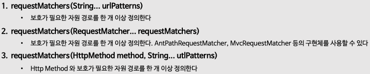

# 인가 프로세스

> 인프런의 정수원님의 스프링 시큐리티 완전 정복 [6.x 개정판]을 보며 실습하고 정리하는 레포지토리 입니다.

## 요청 기반 권한 부여 HttpSecurity.authorizeHttpRequests()
### 개요
- **Spring Security** 는 요청 기반 권한 부여(Request Based Authorization)와 메소드 기반 권한 부여(Method Based Authorization)를 통해 자원에 대한 심층적인 방어를 제공한다.
- 요청 기반 권한 부여는 클라이언트의 요청 즉 **HttpServletRequest** 에 대한 권한 부여를 모델링 하는 것이며 이를 위해 **HttpSecurity** 인스턴스를 사용하여 권한 규칙을 선언 할 수 있다.

### 요청 기반 권한 부여 - HttpSecurity.authorizeHttpRequests()
.png)
- `authorizeHttpRequests()` 는 사용자의 자원 접근을 위한 요청 엔드 포인트와 접근에 필요한 권한을 매핑시키기 위한 규칙을 설정하는 것으로서 서블릿 기반
  엔드포인트에 접근하려면 `authorizeHttpRequests()` 에 해당 규칙들을 포함해야 한다.
- `authorizeHttpRequests()` 를 통해 요청과 권한 규칙이 설정되면 내부적으로 `AuthorizationFilter` 가 요청에 대한 권한 검사 및 승인 작업을 수행한다.

### authorizeHttpRequests() API 
- **requestMatchers()**
    
  - **requestMatchers 메소드**는 HTTP 요청의 URL 패턴, HTTP 메소드, 요청 파라미터 등을 기반으로 어떤 요청에 대해서는 특정 보안 설정을 적용하고,
  다른 요청에 대해서는 적용하지 않도록 세밀하게 제어할 수 있게 해준다.
  - 예를 들어 특정 API 경로에만 **CSRF 보호**를 적용하거나, 특정 경로에 대해 인증을 요구하지 않도록 설정할 수 있다.
    - 이를 통해 애플리케이션의 보안 요구 사항에 맞춰서 유연한 보안 정책을 구성할 수 있다.
  - 엔드 포인트 & 권한 부여
    

### 보호 자원과 권한 규칙 설정하기

- 주의 사항
  - 스프링 시큐리티는 클라이언트의 요청에 대하여 위에서 부터 아래로 나열된 순서대로 처리하며 요청에 대하여 첫 번째 일치만 적용되고 다음 순서로 넘어가지 않는다.
  - `/admin/**` 가 `/admin/db` 요청을 포함하므로 의도한 대로 권한 규칙이 올바르게 적용 되지 않을 수 있다. 
    - 그렇기 때문에 엔드 포인트 설정 시 좁은 범위의 경로를 먼저 정의하고 그것 보다 큰 범위의 경로를 다음 설정으로 정의 해야 한다.

### 권한 규칙 종류

- 권한 규칙은 내부적으로 **AuthorizationManager 클래스**에 의해 재구성되며, 모든 요청은 여러 종류의 **AuthorizationManager**에 설정된 권한 규칙에
따라 승인 혹은 거부된다.

## 표현식 및 커스텀 권한 구현
### 표현식 권한 규칙 설정
- 스프링 시큐리티는 표현식을 사용해서 권한 규칙을 설정하도록 **WebExpressionAuthorizationManager**를 제공한다.
- 표현식은 시큐리티가 제공하는 권한 규칙을 사용하거나 사용자가 표현식을 커스텀하게 구현해서 설정 가능하다.

### 사용 방법
- `requestMatchers().access(new WebExpressionAuthorizationManager("expression"))`

### 적용 하기

### 커스텀 권한 표현식 구현

### 커스텀 RequestMatcher 구현

## 요청 기반 권한 부여 - HttpSecurity.securityMatcher()
### securityMatcher()
- **securityMatcher** 메소드는 특정 패턴에 해당하는 요청에만 보안 규칙을 적용하도록 설정할 수 있으며 중복해서 정의할 경우 마지막에 설정한 것으로 대체한다.
- **securityMatcher(String... urlPatterns)**
  - 특정 자원 보호가 필요한 경로를 정의한다.
- **securityMatcher(RequestMatcher... requestMatchers)**
  - 특정 자원 보호가 필요한 경로를 정의한다. 
  - AntPathRequestMatcher, MvcRequestMatcher 등의 구현체를 사용할 수 있다.
- **패턴 설정**
  

### securityMatchers(Customizer<RequestMatcherConfigurer>)
- **다중 패턴 설정**
  - **securityMatchers** 메소드는 특정 패턴에 해당하는 요청을 단일이 아닌 다중 설정으로 구성해서 보안 규칙을 적용할 수 있으며, 현재의 규칙은 이전의 규칙을 대체하지 않는다. (중복 가능)
- **패턴 유형**
  